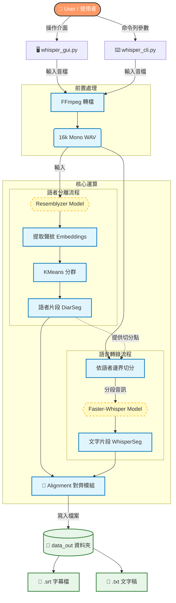

# Whisper Speaker Diarization & Transcription

這是一個基於 Python 的本機端語音轉錄與語者分離工具。專案結合了 **OpenAI Whisper** (透過 `faster-whisper` 加速) 進行高準確度逐字稿轉錄，並利用 **Resemblyzer** 進行聲紋分析以區分不同的說話者。

## 🌟 功能特色

* **雙模式介面**：提供 **GUI (視窗版)** 與 **CLI (命令列版)**，滿足不同使用場景。
* **自動語者分離**：利用深度學習聲紋分析，自動區分並標記說話者 (S1, S2...)。
* **高效轉錄**：使用 `faster-whisper`，比原始 Whisper 快 4-5 倍，且佔用記憶體更少。
* **自動對齊**：將分離出的語者標籤與轉錄文字在時間軸上精準對齊。
* **跨平台支援**：支援 Windows, macOS (含 M1/M2/M3 硬體加速), Linux。
* **格式整合**：自動輸出 `.srt` 字幕檔與 `.txt` 對話紀錄至 `data_out` 資料夾。

## 🛠️ 系統架構



## ⚙️ 安裝需求

### 1. 安裝 FFmpeg (必要)

本工具依賴 FFmpeg 處理音訊格式。請確保您的系統已安裝：

* **macOS**: `brew install ffmpeg`
* **Windows**: [下載 FFmpeg](https://ffmpeg.org/download.html) 並設定環境變數 Path，或使用 `choco install ffmpeg`。
* **Linux**: `sudo apt install ffmpeg`

### 2. 安裝 Python 套件

建議使用 Python 3.9+。請執行以下指令安裝依賴：

```bash
pip install torch numpy librosa soundfile scikit-learn faster-whisper resemblyzer

```

*註：GUI 版本使用 Python 內建的 `tkinter`，通常無需額外安裝。*

## 🚀 使用說明

### 方式一：GUI 圖形介面 (推薦)

適合一般使用者，提供進度條與參數設定視窗。

```bash
python whisper_gui.py

```

1. **選擇檔案**：點擊「瀏覽...」選擇音訊檔案 (mp3, wav, m4a...)。
2. **設定參數**：
* **Model**: 建議選擇 `medium` (平衡速度與準確度)。
* **Language**: 設定音訊語言 (如 `zh`, `en`)。
* **預估人數**: 若已知人數可填入，否則填 `0` 讓系統自動偵測。


3. **執行**：點擊「開始處理」，程式將自動建立 `data_out` 資料夾並輸出結果。

### 方式二：CLI 命令列

適合開發者或批次處理腳本。

1. 打開 `whisper_cli.py` 編輯上方的設定區塊：
```python
INPUT_FILE  = "meeting.mp3"
SPEAKERS = 3       # 或 None
MODEL = "medium"

```


2. 在終端機執行：
```bash
python whisper_cli.py

```


## 📂 輸出檔案結構

所有輸出的檔案將自動存放於專案目錄下的 `data_out` 資料夾：

```text
Project/
├── data_out/
│   ├── filename.wav    # 轉換後的 16k 單聲道音檔
│   ├── filename.srt    # [字幕] 包含時間軸與語者標籤
│   └── filename.txt    # [文字] 純文字對話紀錄
├── whisper_gui.py      # 圖形介面程式
├── whisper_cli.py      # 命令列程式
└── README.md

```

## 📝 常見問題 (FAQ)

1. **第一次執行為什麼很久？**
* 初次執行時，程式需要從網路下載 Whisper 模型 (約 1~3GB) 與 Resemblyzer 權重，請耐心等候。之後執行會直接讀取快取。


2. **Mac 出現 `SparseMPS` 警告？**
* 程式已內建環境變數 `PYTORCH_ENABLE_MPS_FALLBACK=1`，這會自動處理 M1/M2 晶片上部分算子不支援的問題，請忽略該警告。


3. **如何提高準確度？**
* 將模型改為 `large-v2` 或 `large-v3`，但速度會變慢。
* 在 GUI 中手動指定正確的「語者人數」，這對分離效果幫助很大。


## 📜 License

本專案使用以下開源專案技術：

* [faster-whisper](https://github.com/SYSTRAN/faster-whisper) (MIT)
* [Resemblyzer](https://github.com/resemble-ai/Resemblyzer) (Apache 2.0)
